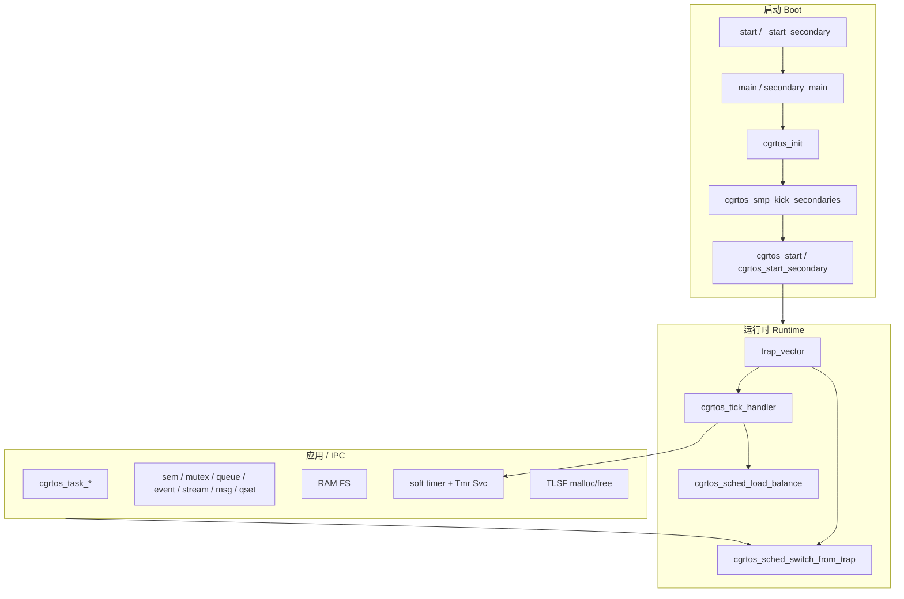
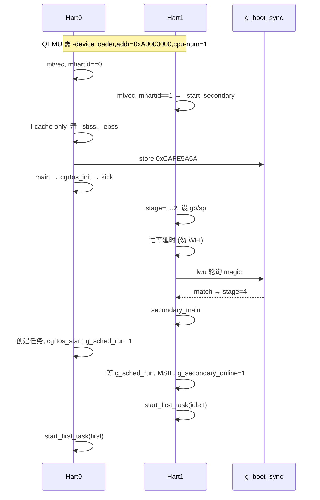
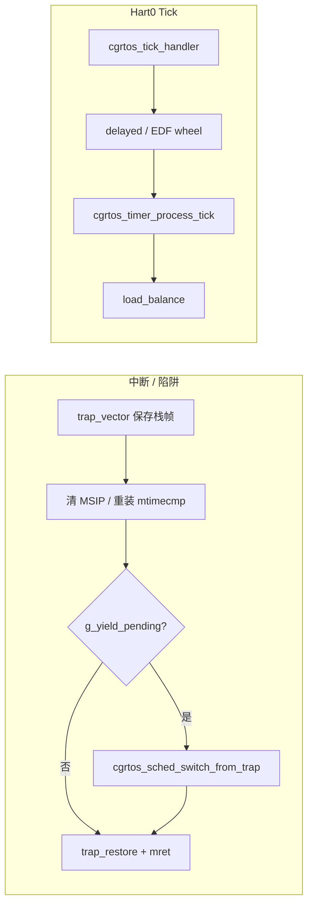
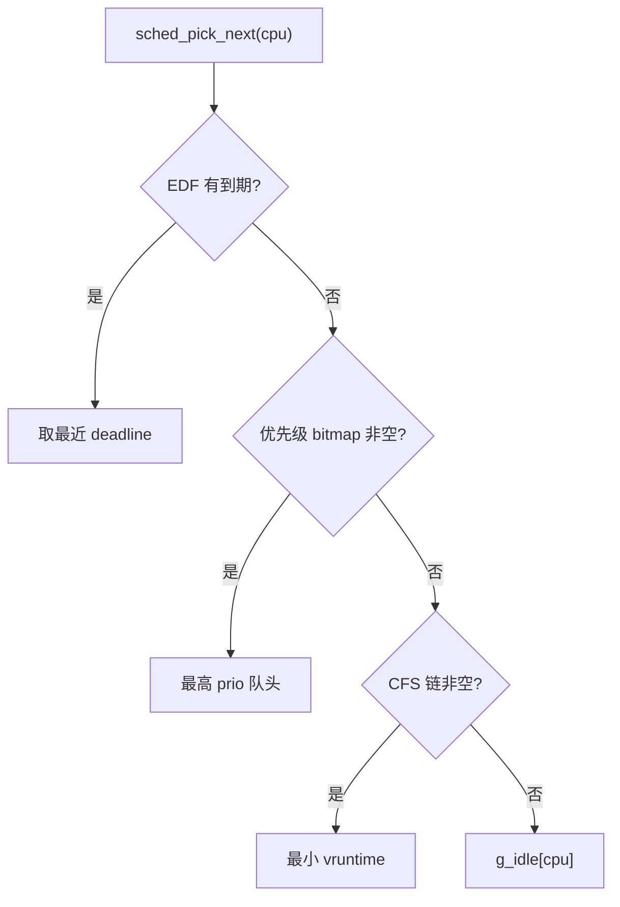
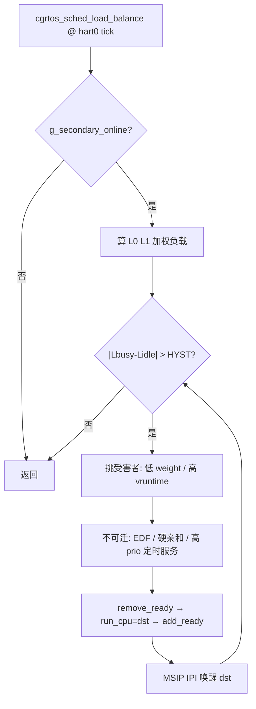
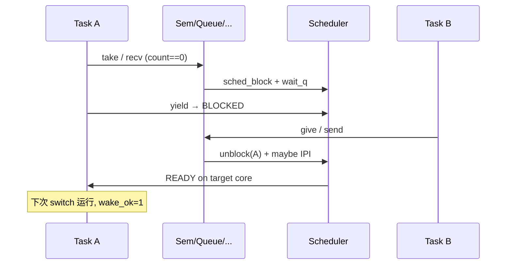
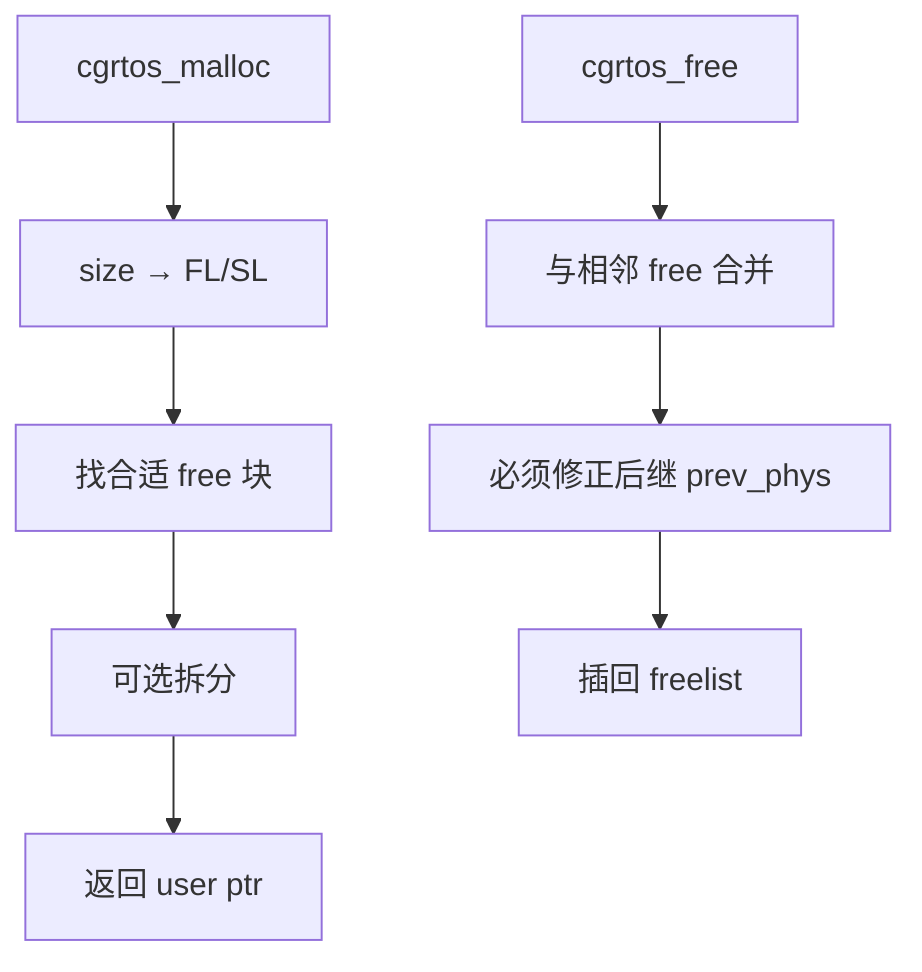

# CG-RTOS 主流程与架构详解

本文配合源码中的 **Doxygen** 注释（`kernel/cgrtos.h`、各 `.c` / `startup.S`），用流程图说明系统主路径。

生成 API 文档 / SDK：

```bash
./scripts/cgrtos.sh sdk    # docs/doxygen + 打包 sdk/
# 或仅 HTML：
./scripts/cgrtos.sh docs
```
---

## 1. 总体结构



| 层级 | 路径 | 职责 |
|------|------|------|
| 引导 | `startup.S` | BSS、双核同步、trap、首次 `mret` |
| 内核核 | `kernel/cgrtos.c` | 初始化、临界区、统计、SMP kick |
| 调度 | `kernel/scheduler.c` | 就绪队列、tick、切换、均衡 |
| 任务 | `kernel/task.c` | 创建/删除/延时/通知/idle |
| IPC | `kernel/ipc.c` | 信号量/互斥/队列/事件 |
| 流缓冲 | `kernel/stream_buffer.c` | StreamBuffer / MessageBuffer |
| QueueSet | `kernel/queue_set.c` | 多对象 select |
| RAM FS | `kernel/fs.c` | `/` 纯内存文件/目录 |
| 定时 | `kernel/timer.c` | 时间轮 + daemon |
| 堆 | `kernel/mem.c` | TLSF |
| 平台 | `arch/riscv/*` | CLINT/UART/PLIC/IPI |
| 公开头 | `kernel/cgrtos.h` | 全部宏/类型/API（Doxygen） |
| SDK 包 | `./scripts/cgrtos.sh sdk` | `sdk/include` + `sdk/docs/api` |

---

## 2. 双核 Boot 流程



要点：

1. **`lwu` 而非 `lw`**：magic `0xCAFE5A5A` 最高位为 1，`lw` 符号扩展后与 `li` 结果不相等。
2. **`.sbss` 必须算进 BSS 清零**（见 `cgrtos.lds`）。
3. **QEMU 上 hart1 禁止长期 WFI**，否则共享 `mtime` 可能停。
4. **`g_secondary_online` 仅在进入调度后置位**，避免 LB 把任务迁到尚未调度的核。

---

## 3. 调度与上下文切换



就绪选择（简化）：



策略差异：

| 策略 | 行为 |
|------|------|
| `SCHED_PRIORITY` | 同等优先级粘滞（tick 不强制轮转，除非 `force_yield`） |
| `SCHED_RR` | 时间片轮转 |
| `SCHED_CFS` | `vruntime` 排序 |
| `SCHED_EDF` | deadline 排序 + release wheel |
| `SCHED_HYBRID` | `prio >= CONFIG_RT_PRIO_THRESHOLD` → Priority，否则 CFS |

---

## 4. SMP 加权负载均衡（Push）



Idle Steal（`CONFIG_SMP_IDLE_STEAL`，默认 0）在空闲循环反向拉取。

跨核唤醒：`cgrtos_sched_unblock` / `cgrtos_task_create` / `set_affinity` 在目标核 ≠ 本核时发 IPI。

---

## 5. IPC / 阻塞 / 唤醒



临界区：`cgrtos_enter_critical` = 关本核 IRQ + 全局 `g_klock`（可嵌套）。  
`g_ready_lock` 侧：关本地 IRQ 后再抢锁，避免 ISR 重入死锁。

补充对象（与 Queue 相同阻塞模型）：

- **StreamBuffer / MessageBuffer**（`kernel/stream_buffer.c`）：字节流与整消息（长度前缀）
- **QueueSet**（`kernel/queue_set.c`）：对 Queue/Sem/Stream 做 `select`
- **抢占**：tick / 唤醒路径上更高优先级任务可抢占当前任务（`SCHED_PRIORITY` 等）
- **RAM FS**（`kernel/fs.c`）：`/` 挂载，`open/read/write/mkdir/unlink/readdir`

---

## 6. 软定时器


回调**不在 ISR 里执行**，在 daemon 任务上下文执行。

---

## 7. TLSF 堆（`mem.c`）



---

## 8. 陷阱向量类别

| mcause | 处理 |
|--------|------|
| 中断 3 MSIP | `riscv_handle_ipi` → `g_yield_pending` |
| 中断 7 MTIP | `riscv_handle_timer` → tick（hart0 推进 `g_ticks`） |
| 中断 11 MEIP | PLIC claim / complete |
| 异常 11 ecall | 自愿 yield（`g_yield_pending`） |
| 其它异常 | 打印后 `_deadloop` |

---

## 9. 相关源码入口

| 主题 | 符号 / 文件 |
|------|-------------|
| Boot | `_start`, `_start_secondary`, `g_boot_sync` |
| 启动 API | `cgrtos_init`, `cgrtos_start`, `cgrtos_start_secondary` |
| 调度 | `cgrtos_tick_handler`, `cgrtos_sched_switch_from_trap` |
| 均衡 | `cgrtos_sched_load_balance`, `cgrtos_sched_idle_steal` |
| 公开头文件 | `kernel/cgrtos.h`（全部宏/类型/API 的 Doxygen） |

完整用法、SMP 算法、GDB 实战：见 `docs/USER_GUIDE.md`。
