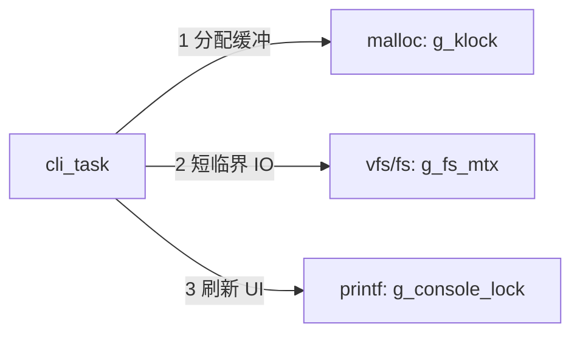

# CLI POSIX vi 与路径补全

交互式 shell 应用位于 [`cli/`](../cli/)（`APP=cli`），测试用例仍在 `tests/`。

| 文件 | 职责 |
|------|------|
| `cli/cli_main.c` | 入口、命令分发、`cli_line_read` 主循环 |
| `cli/cli_line.*` | 行编辑：光标、历史、Tab 钩子 |
| `cli/cli_path.*` | CWD 会话、路径规范化、`cli_path_complete` |
| `cli/cli_fs.*` | VFS 文件系统命令 |
| `cli/cli_vim.*` | POSIX vi 全屏编辑器 |

启动：

```bash
./scripts/cgrtos.sh cli --cores 2
# 或
./scripts/build.sh --app cli --cores 2
./scripts/run.sh  --app cli --cores 2
```

裁剪：`CONFIG_CLI_FS` / `CONFIG_CLI_VIM`（vim 依赖 FS）；`CGRTOS_VIM_UNDO_MAX` / `CGRTOS_VIM_CLIP_MAX` 等见 `kernel/cgrtos_config.h`。

---

## 1. 行编辑与 Tab 补全

| 键 | 行为 |
|----|------|
| ← / → | 光标移动 |
| ↑ / ↓ | 命令历史 |
| Tab | 补全光标处路径 token（唯一匹配补全；多匹配最长公共前缀；目录加 `/`） |
| Tab Tab | 列出全部匹配后重绘提示符 |
| Backspace / Delete | 删除 |
| Ctrl-C | 清空当前行 |

异常：非法路径、非目录、`opendir` 失败、匹配过多、行溢出、OOM —— 打印原因，**不破坏**已输入行内容；无匹配响铃 `\a`。

---

## 2. vi 命令与键位（A 档 POSIX 核心）

入口：`vi` / `vim` / `edit` `<file>`。

### 模式

| 模式 | 进入 | 离开 |
|------|------|------|
| Normal | 默认 / Esc | — |
| Insert | `i` `I` `a` `A` `o` `O` | Esc；Ctrl-C 回 Normal |
| Visual | `v` | Esc / `d`/`y`/`x`；Ctrl-C |
| Cmdline | `:` `/` `?` | Enter 执行；Esc / Ctrl-C 取消 |

### Normal 运动与编辑

| 键 | 作用 |
|----|------|
| `hjkl` | 左下上右（计数前缀 `N`） |
| `w` `b` `e` | 词运动 |
| `0` `^` `$` | 行首 / 首非空白 / 行尾 |
| `G` / `NG` | 文件末 / 第 N 行 |
| `x` `X` `D` | 删字符 / 向前删 / 删至行尾 |
| `dd` `Nd`d | 删行（进匿名剪贴板） |
| `yy` `Y` | 拷行 |
| `p` `P` | 粘贴后 / 前 |
| `u` | undo（环形栈，深度 `CGRTOS_VIM_UNDO_MAX`） |
| `.` | 重复上次改动 |
| `/pat` `?pat` `n` `N` | 搜索 |
| `:…` | Ex（见下） |

### Ex

| 命令 | 行为 |
|------|------|
| `:w` / `:w path` | 写回；失败保留 dirty |
| `:q` | 干净则退出；dirty 拒绝 |
| `:q!` | 丢弃修改退出 |
| `:wq` | 写后退出 |
| `:e path` | 换文件（dirty 拒绝） |
| `:set nu` / `:set nonu` | 行号 |

### 状态栏

`filename [+]  MODE  line,col`；底行显示消息或 cmdline。

### 错误约定

- 打开失败 / 超 `CGRTOS_FS_MAX_FILE_BYTES` / 目录 / OOM：**不进入**编辑器，CLI 打印原因。
- 写失败 / 关失败：留在编辑器，`modified` 保持，消息 `E: …`。
- `:q` dirty：`E: No write since last change`。
- 搜索无匹配：`Pattern not found`。
- 未知键 / 未知 Ex：提示，不损坏缓冲。

### Ctrl-C

| 上下文 | 行为 |
|--------|------|
| Insert / Cmdline / Visual | 中止当前输入 → Normal |
| Normal | 提示用 `:q`，**不**丢缓冲 |
| CLI 行编辑 | 清空行 |

---

## 3. 并发保护

| 数据 | 保护方式 | 约定 |
|------|----------|------|
| 编辑器 text / undo / clip / 模式状态 | **无锁** | 仅 `cli` 任务访问；不跨任务共享 |
| `g_sess` CWD（`cli_path`） | **无锁** | 仅 CLI 任务；多 CLI 任务写会话为**未定义行为** |
| RAM FS 树 / fd | `g_fs_mtx`（非递归，`fs.c`） | 经 `vfs_*` → `cgrtos_fs_*`；**持锁禁止** `printf` / `getc` / `yield` / `malloc` |
| 堆 | `g_klock`（`cgrtos_malloc`） | load 前先 malloc，再 open/read |
| 控制台 | `g_console_lock`（与 `g_klock` 解耦） | 禁止持 `g_fs_mtx` 时 `cgrtos_printf` |
| UART RX | 硬件 FIFO，无软件环 | vi 接管期间独占 poll；退出后主循环再读 |

### 锁顺序（必须遵守）



合法：`malloc` →（释放堆锁）→ `vfs_open/read/write` →（释放 FS 锁）→ `printf` / 画屏。

非法：

1. 持 `g_fs_mtx` → 阻塞 UART / `getc` / `yield`
2. 持 `g_fs_mtx` → `cgrtos_malloc`（再进 `g_klock` / 可能日志）
3. 持 `g_fs_mtx` → `cgrtos_printf`（再取 `g_console_lock`）

---

## 4. 死锁 / 抢占 / 中断竞态（主动说明）

1. **FS 饿死**：持 `g_fs_mtx` 时等待键盘 → 其他核/任务 `vfs_*` 永久阻塞。**缓解**：编辑器仅在松锁后 `vim_pollc` / 画屏。
2. **锁顺序死锁**：FS → 堆 → 控制台交叉。**缓解**：上节顺序；load 失败路径先 close/free 再打印。
3. **`fs_abort_poll` 吞字节**：长 `cat`/`cp` 轮询 Ctrl-C 会吃掉一个 UART 字节。补全/vi 与 FS 长 IO **同属 cli 任务、不会并行**；无跨任务 RX 竞态。
4. **抢占**：更高优先级任务可打断 cli，但不得访问编辑器缓冲；FS 仍靠 `g_fs_mtx`。编辑器状态无锁故**禁止**第二 CLI 任务。
5. **ISR**：`cli_line` / `cli_path_complete` / `cli_vim_*` 全部 **❌ ISR**；ISR 中调 UART 阻塞路径会拉长中断延迟并可能与 `g_console_lock` 冲突。

---

## 5. 手工验收 checklist

- [ ] `touch a.txt` → `vi a.txt` → `i` 输入 → Esc → `:w` → `:q` → `cat a.txt`
- [ ] 修改后 `:q` 拒绝 → `:q!` 退出
- [ ] `/pat` + `n`；`dd` / `yy` / `p`；`u`；`.`
- [ ] `:set nu` 显示行号
- [ ] Tab：`cat /` + Tab 列目录；相对路径补全
- [ ] `PROFILE=minimal` 仍能编译（CLI FS/VIM 关闭时 demo/test 不受影响）

---

## 6. 明确不做（相对桌面 Vim）

命名寄存器、宏、可视块、`:s///`、分屏、语法高亮、插件、`.vimrc`。
